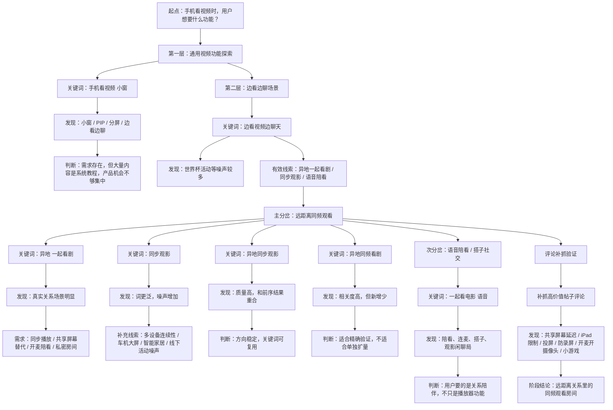

# 手机看视频功能探索路径图与搜索结果

生成日期：2026-06-28  
数据范围：本次“手机看视频时用户想要什么功能”探索任务，以及已保存的 R11–R15 去重标注结果。  
数据来源：

- SQLite：`database/sqlite_tables.db`
- 已有分析报告：`explore/reports/2026-06-28_phone-video-sync-watch-opportunities.md`
- 已有标注 CSV：`explore/reports/2026-06-28_phone-video-sync-watch-labeled-posts.csv`

说明：

- “直接命中帖子”按 `xhs_note.source_keyword` 统计，代表该关键词直接搜索入库的帖子。
- “库内评论”按当前 SQLite 中 `xhs_note_comment` 实际入库数量统计，已包含后续评论补抓增量。
- “平台评论”来自帖子详情页记录的 `comment_count`，不等于当前已抓全量评论。
- “命中关键词”来自去重标注 CSV，表示同一帖子可能被多个探索关键词命中过。

## 1. 探索路径图

## 2. 搜索路径表

| 阶段 | 关键词 | 作用 | 结果判断 | 下一步 |
|---|---|---|---|---|
| 起点 | 手机看视频 小窗 | 从通用手机视频功能切入 | 小窗、PIP、分屏需求明确，但教程内容多 | 转向“边看边聊”场景 |
| 过渡 | 边看视频边聊天 | 验证视频观看与聊天并行需求 | 噪声较多，但出现“异地一起看剧”线索 | 分岔到远距离同频观看 |
| 主线 | 异地 一起看剧 | 捕捉真实异地关系场景 | 相关度高，出现同步、开麦、共享屏幕替代 | 扩展到同步观影视角 |
| 扩展 | 同步观影 | 扩大“同步观看”语义范围 | 覆盖面广但噪声明显，包括线下活动、车机、多设备 | 增加限定词降噪 |
| 收敛 | 异地同步观影 | 用“异地”限定同步观影 | 质量高，和前序高价值帖重合 | 确认方向稳定 |
| 精确验证 | 异地同频看剧 | 验证“同频”表达是否有效 | 相关度高但新增少 | 作为精确验证词保留 |
| 旁路 | 一起看电影 语音 | 验证陪看/开麦/搭子需求 | 补充“关系陪伴”和社交互动信号 | 合并进产品机会判断 |

## 3. 关键词搜索结果

| 关键词 | 直接命中帖子 | 平台评论合计 | 库内评论 | 代表性帖子 |
|---|---:|---:|---:|---|
| 手机看视频 小窗 | 16 | 111 | 24 | 苹果分屏小窗；苹果手机如何分屏操作；苹果也可以分屏啦 |
| 边看视频边聊天 | 10 | 195 | 9 | 边看边聊世界杯；异地 一起看剧 |
| 异地 一起看剧 | 18 | 163 | 26 | 线上找观影搭子；觅讯会议异地恋神器；小众宝藏 App |
| 同步观影 | 18 | 82 | 21 | “看”你看的电影；网易爆米花媒体库；车机/露天电影等泛化内容 |
| 异地同步观影 | 9 | 34 | 20 | 异地同步追剧看番观影攻略；异地恋共享屏幕邪修大法；V+观影会员 |
| 异地同频看剧 | 3 | 0 | 0 | 捡漏元宝派；异地从不会让我们感情变淡；恋爱日常同步看视频 |
| 一起看电影 语音 | 5 | 8 | 5 | 和 char 一起看恐怖电影；聊电影，遇同频；线上观影闲聊局 |

## 4. 高价值帖子与多关键词命中

下表按已有标注分数排序，并使用当前数据库重新统计库内评论数。

| 分数 | 类型 | 日期 | 命中关键词 | 平台评论 | 库内评论 | 标题 | note_id |
|---:|---|---|---|---:|---:|---|---|
| 18 | 明确痛点帖 | 2026-01-13 | 异地同频看剧,异地同步观影,一起看电影 语音 | 10 | 4 | 异地 一起看剧 | `6965ddd7000000002200bfce` |
| 16 | 替代方案帖 | 2026-02-08 | 异地同频看剧,异地同步观影 | 24 | 11 | 异地同步追剧看番观影攻略 | `6987488b000000000a033d91` |
| 15 | 替代方案帖 | 2026-05-08 | 异地 一起看剧,异地同频看剧,异地同步观影 | 2 | 1 | 异地恋同步观影指南❗️ | `69fcd9b8000000002202980f` |
| 14 | 社交搭子帖 | 2026-04-09 | 异地 一起看剧,异地同步观影 | 12 | 3 | 惊艳到爆！6 个你不知道的小众宝藏 App | `69d7b783000000001a026999` |
| 13 | 替代方案帖 | 2026-06-25 | 异地同步观影 | 0 | 0 | 异地恋升温，不用见面也能升温的 7 个方法 | `6a3d3a07000000001503da62` |
| 12 | 替代方案帖 | 2026-01-19 | 异地 一起看剧 | 16 | 8 | 拜托！！原来觅讯会议才是真正的异地恋神器 | `696df602000000002203b5e6` |
| 12 | 替代方案帖 | 2026-02-13 | 异地同频看剧,异地同步观影 | 4 | 4 | 异地恋的共享屏幕邪修大法 | `698e9105000000001d027f8f` |
| 12 | 替代方案帖 | 2026-06-26 | 异地 一起看剧 | 0 | 0 | iPhone 情侣模式太甜了叭 | `6a3d6760000000000f0144b0` |
| 11 | 替代方案帖 | 2026-02-01 | 异地同频看剧 | 0 | 0 | 捡漏元宝派！工作摸鱼全拿捏 | `697ec83e000000002202d792` |
| 11 | 明确痛点帖 | 2026-02-05 | 异地同频看剧,异地同步观影 | 1 | 1 | 异地情侣看剧别再傻傻倒数 321 了 | `698452cc00000000210335e9` |
| 11 | 产品安利帖 | 2026-05-21 | 异地 一起看剧,异地同步观影 | 3 | 2 | 我搭了一个电影房间☁️ | `6a0e9f45000000000702de5e` |
| 10 | 替代方案帖 | 2026-02-15 | 异地 一起看剧,异地同频看剧 | 0 | 0 | 异地恋过年就要用腾讯会议一起看知否！ | `6991b2c5000000000b00acc0` |
| 10 | 替代方案帖 | 2026-03-20 | 异地同步观影 | 0 | 0 | 这玩应谁研究的，谈恋爱有点好用 | `69bc94d30000000023026cfe` |
| 10 | 社交搭子帖 | 2026-03-21 | 一起看电影 语音 | 6 | 3 | 和 char 一起看恐怖电影——「指令」 | `69be944b000000001d01c7af` |
| 10 | 社交搭子帖 | 2026-04-27 | 异地 一起看剧 | 113 | 3 | 线上找观影搭子，综艺/电视剧/电影 | `69ef74630000000035030361` |
| 10 | 明确痛点帖 | 2026-06-22 | 异地 一起看剧,异地同频看剧,异地同步观影 | 0 | 0 | 异地第一天我俩就打开了新世界 | `6a38acf5000000000f0149b9` |
| 9 | 社交搭子帖 | 2026-06-08 | 异地 一起看剧,异地同步观影 | 0 | 0 | 异地恋小甜互动游戏，来糖化一下🍬 | `6a26937d0000000021019abe` |
| 8 | 明确痛点帖 | 2026-01-03 | 异地同频看剧 | 0 | 0 | 异地从不会让我们感情变淡 | `6958d9f1000000001e011b98` |
| 8 | 产品安利帖 | 2026-02-05 | 异地同步观影 | 0 | 0 | 开源项目 Reel-Sync 实时同步观影工具 | `69846f1c000000002202df5a` |
| 8 | 替代方案帖 | 2026-06-07 | 异地 一起看剧 | 8 | 4 | 是谁！异地剧女又同天看剧 | `6a252468000000000803c88f` |
| 8 | 明确痛点帖 | 2026-06-12 | 同步观影,异地同步观影 | 0 | 0 | 原来，不在一起也能一起看球赛 | `6a2bd0530000000021022c2c` |
| 8 | 替代方案帖 | 2026-06-12 | 异地 一起看剧 | 6 | 3 | 恋爱滴滴，一起打游戏一起看剧 | `6a2ae480000000001700bb76` |

## 5. 三类帖子抽查

| 类型 | 示例帖子 | 说明 |
|---|---|---|
| 明确痛点帖 | `6965ddd7000000002200bfce`：异地 一起看剧 | 用户明确描述“微信语音 + 两边同时点播放”的 workaround，说明核心痛点是同步播放而不是内容消费本身。 |
| 替代方案帖 | `6987488b000000000a033d91`：异地同步追剧看番观影攻略 | 用户主动寻找 Syncplay、会议共享、影视 App 一起看等替代方案，说明现有方案分散且有门槛。 |
| 噪声/广告帖 | `6a2f6784000000001502690c`：端午自驾碎片观影 | 命中“同步观影”但语义偏车机/泛观影，不是远距离关系陪看需求，应在后续分析中降权。 |

## 6. 评论补抓后的需求信号

补抓评论后，高价值帖里出现了更具体的使用摩擦：

- 共享屏幕存在延迟：用户直接提到“共享屏幕会有延迟”。
- 设备限制明显：出现“iPad 不让我共享屏幕”。
- 投屏诉求存在：用户问“可以投屏看电视吗”。
- 陪看不只是同步：用户提到同学一起开摄像头和麦克看电影，说明“反应同步”和“陪伴感”重要。
- 隐私/安全功能会被感知：防录屏被用户作为优点提到。
- 互动增强有空间：评论里出现“小游戏”作为共享屏幕/同屏玩法的延伸。

## 7. 阶段性产品判断

当前最清晰的机会点不是“做一个更强的视频播放器”，而是：

> 远距离关系里的同频观看房间。

更具体地说，用户想要的是：

- 各自播放本地或平台高清片源，避免共享屏幕带来的画质和延迟问题。
- 自动同步播放、暂停、拖动进度，减少“3、2、1 一起点”的低效沟通。
- 内置语音、文字、表情、小游戏，让观看过程带有陪伴和互动。
- 私密房间、邀请机制、防录屏或隐私提示，适配情侣/朋友之间的私密场景。
- 兼容多设备、投屏、会员平台、广告和版权限制，降低真实使用门槛。

后续若继续探索，建议不要再泛搜“同步观影”，而是优先围绕以下方向扩展：

1. `异地 一起看电影`
2. `异地恋 看剧 不同步`
3. `一起看剧 共享屏幕 卡`
4. `远程看电影 开麦`
5. `观影搭子 连麦`

